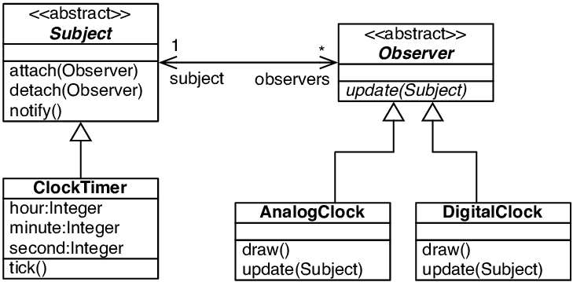

### Observer Design Pattern

- **Observer**: Gözlemci, izelyici anlamlarına gelmektedir.
- Bilinen diğer isimleri: Dependents:bağımlılar, Publish-Subscribe: Yayınla-Abonel ol
- Nesne davranışsaldır.
- **Amaç:** Nesneler arasında birden-çoka ( one-to-many ) bağımlılık tanımla ve bir nesne durum değiştirdiğinde bağımlı olanların otomatik güncellenmesini sağlamaktır. ( Bildirim yapıları vs olabilir. )

Observer Design Pattern UML diyagramı:



Observer tasarım deseni dört ana bileşenden oluşur:

1. **Subject (Konu)**: Gözlemlenen nesnedir. Bir dizi gözlemciyi (observers) tutar ve durumu değiştiğinde onları bilgilendirir.
2. **Observer (Gözlemci)**: Subject'in durumundaki değişiklikler hakkında bilgilendirilen nesnedir.
3. **ConcreteSubject (Somut Konu)**: Subject arayüzünü uygular ve durumu saklar. ConcreteObserver nesnelerine bildirimler gönderir.
4. **ConcreteObserver (Somut Gözlemci)**: Observer arayüzünü uygular ve Subject'in durumunu senkronize eder.

UML Diyagramı Açıklaması

- **Subject**: Observer nesnelerini ekleme (`Attach`), çıkarma (`Detach`), ve bilgilendirme (`Notify`) işlevlerini tanımlar.
- **Observer**: Subject'in durum değişiklikleri hakkında bilgi almak için `Update` işlevini tanımlar.
- **ConcreteSubject**: Subject arayüzünü uygular ve durumu saklar. `GetState` işlevi ile durumu döner.
- **ConcreteObserver**: Observer arayüzünü uygular ve Subject'in durumunu senkronize eder. `Update` işlevi ile Subject'ten güncellenmiş durumu alır.

🔑 Absract Factory design pattern örneğine aşağıdaki [linkten](https://github.com/1omerozturk/Design-Patterns/tree/main/Observer) ulaşabilirsiniz:

```bash
https://github.com/1omerozturk/Design-Patterns/tree/main/Observer
```
